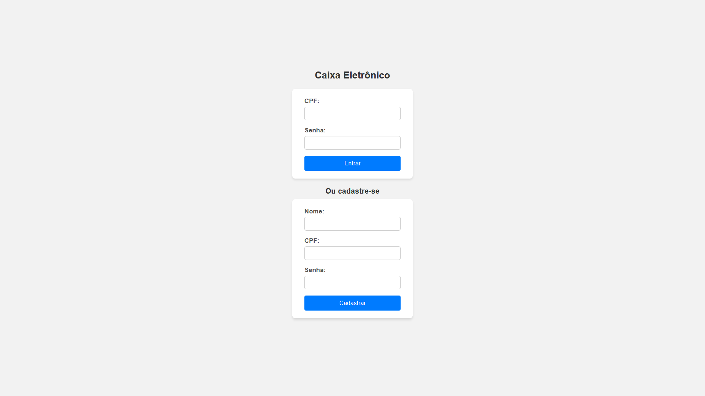
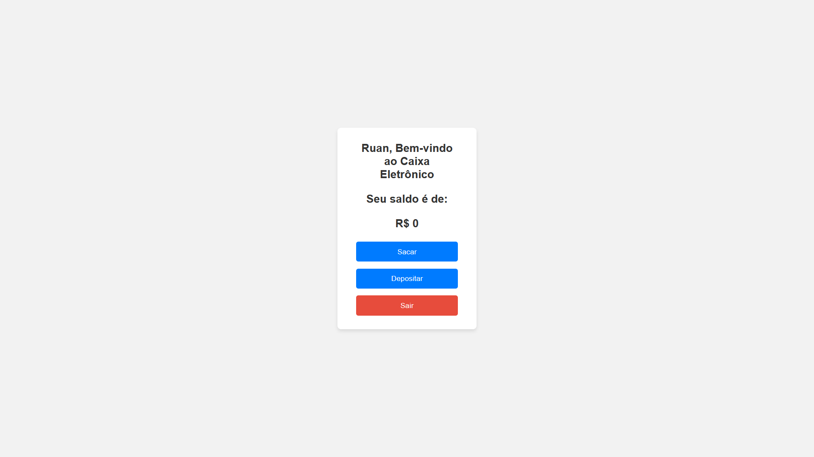
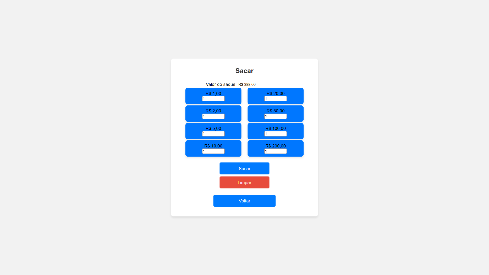
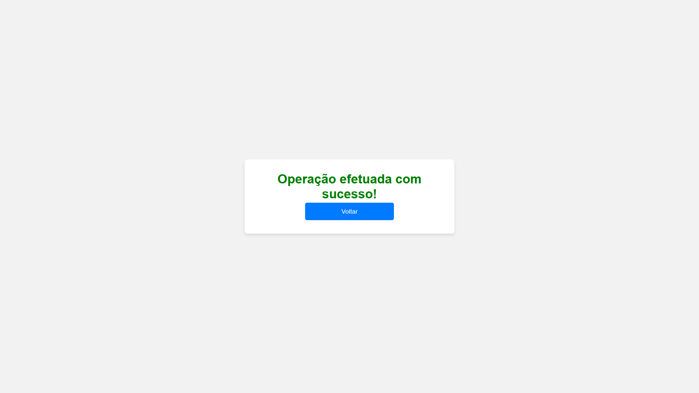

# Sistema de Caixa Eletrônico em PHP

Este projeto foi desenvolvido em **PHP puro**, aplicando o padrão **MVC** e os princípios **SOLID**,  
sem uso de frameworks externos. A estrutura de diretórios foi organizada para refletir uma **arquitetura limpa**,  
similar à de frameworks modernos, mas implementada manualmente para fins **didáticos** e de **clareza**.

---

## ⚙ Funcionalidades

1. **Gestão de Inventário de Cédulas**
   - Adição e remoção de notas de forma dinâmica.
   - Consulta do estoque e do valor total disponível no caixa.
   
2. **Saque com Estratégias Configuráveis**
   - Interface de estratégias (`InterfaceSaqueStrategy`).
   - Estratégia Padrão: Menor quantidade de cédulas.
   - Estratégia Alternativa: Preservação de notas grandes.
   - Saque somente permitido se houver composição exata disponível.

3. **Notificação de Eventos**
   - Interface de notificações (`InterfaceNotificacao`).
   - Implementação para salvar logs em arquivo com data e hora.
   
4. **Sugestão de Valores Alternativos**
   - Identifica quando o valor solicitado não pode ser entregue.
   - Sugere valores alternativos próximos.

5. **Modelo de Contas de Usuário**
   - Identificador único (CPF) para autenticação.
   - Gerenciamento de saldo.
   - Todas operações iniciadas pelo identificador da conta.

---

## 🖥 Prints das Views

### Tela de Login


### Tela do Menu


### Tela de Depósito


### Tela de Saque


### Tela de Operação Concluída


---

## 🚀 Como Executar

1. Certifique-se de ter **PHP 8+** e um servidor local (XAMPP, WAMP ou similar).
2. Clone o repositório:
   ```bash
   git clone https://github.com/jhonRPdoe/Caixa-eletronico.git

    Abra o projeto na pasta public através do navegador:

    http://localhost/caixa-eletronico/public/index.php

    Cadastre uma nova conta e teste as funcionalidades do caixa eletrônico.

---

📝 Autor

Ruan Pereira – ruanpdev@outlook.com
Linkedin - https://www.linkedin.com/in/ruan-pereira-651523237/